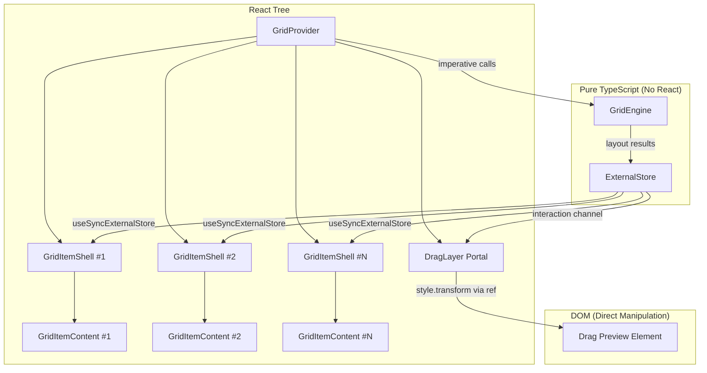
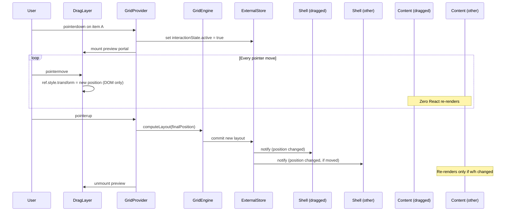

# Design Document: Gridstack Performance Isolation

## Overview

This design introduces a layered, performance-isolated grid layout architecture that decouples widget content rendering from grid interaction state. The core insight is that the current `useGrid` hook + monolithic `GridStack` component conflates layout computation, interaction state, and widget rendering into a single React re-render cascade. A drag move currently triggers `setLayout` / `setOverlay` state updates that re-render the entire grid tree including heavy widget content.

The new architecture separates concerns into distinct layers:

1. **GridEngine** — a pure TypeScript class handling layout logic (collision, reflow, placement, compaction) with zero React dependency
2. **ExternalStore** — a framework-agnostic state container with per-item selectors, compatible with `useSyncExternalStore`
3. **GridItemShell** — a thin positioning wrapper subscribing only to its own slice
4. **GridItemContent** — a memoized boundary preventing widget re-renders during interaction
5. **DragLayer** — a portal-based overlay using direct DOM manipulation for drag/resize previews
6. **GridProvider** — a React context provider exposing hooks and imperative APIs

This achieves the goal: during drag/resize, only the DragLayer DOM updates (via refs), while committed layout changes propagate through the ExternalStore to only the affected Shells—never to widget content unless committed dimensions change.

### Key Design Decisions

| Decision | Rationale |
|----------|-----------|
| Pure TS engine (no React imports) | Testable in isolation, reusable, no accidental re-renders |
| `useSyncExternalStore` over Context | Fine-grained per-item subscriptions without context propagation |
| Two channels (committed + interaction) | Transient pointer state never touches committed subscribers |
| Portal drag layer with DOM manipulation | Pointer-move updates bypass React reconciliation entirely |
| Commit on pointer-up only | Prevents cascading re-renders on every frame during drag |
| FLIP via Web Animations API / CSS transitions | Animation runs on compositor thread, no React state involved |
| Compatibility adapter wrapping new internals | Existing consumers migrate without code changes |

## Architecture



### Data Flow During Drag



## Components and Interfaces

### GridEngine (Pure TypeScript)

```typescript
// grid-engine.ts — NO React imports allowed

export interface GridPosition {
  i: string;
  x: number;
  y: number;
  w: number;
  h: number;
  static?: boolean;
}

export interface GridEngineConfig {
  cols?: number;           // default 12, range 1-48
  rowHeight?: number;      // default 60, range 1-1000
  margin?: [number, number]; // default [10, 10]
  collisionMode?: 'push' | 'swap' | 'push-first' | 'none'; // default 'push'
  maxReflowDepth?: number; // default 8, range 1-50
}

export type LayoutSubscriber = (layout: GridPosition[]) => void;

export class GridEngine {
  constructor(config: GridEngineConfig);

  // State access
  getLayout(): GridPosition[];
  getConfig(): Readonly<GridEngineConfig>;

  // Mutations
  moveItem(id: string, x: number, y: number): GridPosition[];
  resizeItem(id: string, w: number, h: number): GridPosition[];
  addItem(item: GridPosition): GridPosition[] | null;
  removeItem(id: string): GridPosition[] | null;
  setLayout(layout: GridPosition[]): void;

  // Subscriptions
  subscribe(callback: LayoutSubscriber): () => void;

  // Internal (tested via public API)
  private clampToBounds(item: GridPosition): GridPosition;
  private resolveCollisions(layout: GridPosition[], movedItem: GridPosition): GridPosition[];
  private compact(layout: GridPosition[]): GridPosition[];
  private findPlacement(item: GridPosition, layout: GridPosition[]): GridPosition | null;
}
```

### ExternalStore

```typescript
// external-store.ts — Framework-agnostic

export interface StoreState {
  committedLayout: GridPosition[];
  interactionState: InteractionState | null;
}

export interface InteractionState {
  activeItemId: string;
  type: 'drag' | 'resize';
  previewPositions: GridPosition[] | null; // speculative preview
  pointerOffset: { x: number; y: number };
}

export type Selector<T> = (state: StoreState) => T;
export type Subscriber = () => void;

export class GridExternalStore {
  // Committed layout channel
  subscribeCommitted(callback: Subscriber): () => void;
  getCommittedSnapshot(): GridPosition[];

  // Interaction state channel
  subscribeInteraction(callback: Subscriber): () => void;
  getInteractionSnapshot(): InteractionState | null;

  // Per-item selector (returns same reference if unchanged)
  getItemPosition(id: string): GridPosition | null;
  subscribeItem(id: string, callback: Subscriber): () => void;
  getItemSnapshot(id: string): GridPosition | null;

  // Mutations (internal, called by GridProvider)
  commitLayout(layout: GridPosition[]): void;
  setInteractionState(state: InteractionState | null): void;

  // Batch support
  batch(fn: () => void): void;
}
```

### GridProvider

```typescript
// grid-provider.tsx

export interface GridProviderProps {
  children: React.ReactNode;
  items: GridPosition[];
  cols?: number;
  rowHeight?: number;
  margin?: [number, number];
  collisionMode?: 'push' | 'swap' | 'push-first' | 'none';
  onLayoutChange?: (layout: GridPosition[]) => void;
  speculativePreview?: boolean; // default false
  maxReflowDepth?: number;
}

export interface GridContextValue {
  store: GridExternalStore;
  engine: GridEngine;
  startDrag: (itemId: string, pointerId: number, grabOffset: { x: number; y: number }) => void;
  endDrag: () => void;
  startResize: (itemId: string, pointerId: number, corner: string) => void;
  endResize: () => void;
  addItem: (item: GridPosition) => { success: boolean; layout?: GridPosition[] };
  removeItem: (id: string) => { success: boolean; layout?: GridPosition[] };
  containerRef: React.RefObject<HTMLDivElement>;
  pxHelpers: PxHelpers;
}

// Hook: useGridItem
export function useGridItem(id: string): GridPosition | null;

// Hook: useGridActions (stable references)
export function useGridActions(): {
  startDrag: GridContextValue['startDrag'];
  endDrag: GridContextValue['endDrag'];
  startResize: GridContextValue['startResize'];
  endResize: GridContextValue['endResize'];
  addItem: GridContextValue['addItem'];
  removeItem: GridContextValue['removeItem'];
};
```

### GridItemShell

```typescript
// grid-item-shell.tsx

export interface GridItemShellProps {
  id: string;
  children: React.ReactNode;
  isDraggable?: boolean;
  isResizable?: boolean;
}

// Internally:
// - Uses useSyncExternalStore with per-item selector
// - Applies CSS translate3d + explicit width/height
// - Wraps children in React.memo boundary
// - Registers a ref for FLIP animations
```

### GridItemContent

```typescript
// grid-item-content.tsx

export interface GridItemContentProps {
  id: string;
  widthPx: number;   // committed cell width in pixels
  heightPx: number;  // committed cell height in pixels
  children: React.ReactNode;
}

// React.memo with custom comparator:
// re-renders only if widthPx or heightPx changed
```

### DragLayer

```typescript
// drag-layer.tsx

export interface DragLayerProps {
  // No props needed — reads from ExternalStore interaction channel
}

// Internally:
// - Renders via React portal to document.body (or dedicated container)
// - On pointer move: updates style.transform directly via ref (no setState)
// - Displays a lightweight placeholder (max 10 DOM nodes)
// - Unmounts on interaction end
```

### CompatibilityAdapter

```typescript
// compatibility-adapter.tsx

export interface CompatibilityAdapterProps extends GridStackProps {
  // Accepts full legacy GridStackProps interface
  // Internally maps to GridProvider + GridItemShell + GridItemContent
}

// Key behaviors:
// - Normalizes "id" → "i" on items
// - Maps componentMap entries to GridItemContent wrappers
// - Translates dragMode/collisionMode enums
// - Invokes onLayoutChange with "i" property (not "id")
```

## Data Models

### Layout Position (GridPosition)

```typescript
interface GridPosition {
  i: string;      // unique identifier
  x: number;      // column index (0-based, integer >= 0)
  y: number;      // row index (0-based, integer >= 0)
  w: number;      // width in columns (integer >= 1)
  h: number;      // height in rows (integer >= 1)
  static?: boolean; // if true, cannot be moved or displaced
}
```

**Invariants:**
- `x >= 0`, `y >= 0`
- `w >= 1`, `h >= 1`
- `x + w <= cols`
- All `i` values are unique within a layout

### Store Snapshot Structure

```typescript
// Committed channel snapshot
type CommittedSnapshot = GridPosition[];

// Interaction channel snapshot
interface InteractionSnapshot {
  activeItemId: string;
  type: 'drag' | 'resize';
  previewPositions: GridPosition[] | null;
  pointerOffset: { x: number; y: number };
  startTime: number;
}

// Per-item snapshot (returned by getItemSnapshot)
// Returns the same object reference if position unchanged
type ItemSnapshot = GridPosition | null;
```

### Engine Configuration

```typescript
interface GridEngineConfig {
  cols: number;           // 1-48, default 12
  rowHeight: number;      // 1-1000px, default 60
  margin: [number, number]; // [horizontal, vertical] in px, default [10, 10]
  collisionMode: 'push' | 'swap' | 'push-first' | 'none';
  maxReflowDepth: number; // 1-50, default 8
}
```

### Pixel Helpers (derived, not stored)

```typescript
interface PxHelpers {
  colWidth: number;
  rowHeight: number;
  marginX: number;
  marginY: number;
  containerPadding: [number, number];
  gridToPx(pos: number, isVertical?: boolean): number;
  pxToGrid(px: number, isVertical?: boolean): number;
  widthPx(w: number): number;
  heightPx(h: number): number;
}
```


## Correctness Properties

*A property is a characteristic or behavior that should hold true across all valid executions of a system—essentially, a formal statement about what the system should do. Properties serve as the bridge between human-readable specifications and machine-verifiable correctness guarantees.*

### Property 1: Layout Bounds Invariant

*For any* GridEngine configuration with column count C, and *for any* layout mutation (move, resize, add, remove) applied to any item, every item in the resulting layout SHALL satisfy: `x >= 0`, `y >= 0`, `w >= 1`, `h >= 1`, and `x + w <= C`.

**Validates: Requirements 1.4**

### Property 2: Subscription Notification on Mutation

*For any* GridEngine with at least one subscriber, and *for any* layout mutation (move, resize, add, remove), the subscriber callback SHALL be invoked exactly once with the new layout array. Additionally, *for any* GridEngine with zero subscribers, the same mutation SHALL update the internal layout retrievable via `getLayout()`.

**Validates: Requirements 1.3, 1.7**

### Property 3: Selective Subscriber Notification

*For any* ExternalStore containing N items (N >= 2), and *for any* single-item position change to item A, subscribers registered for item B (where B ≠ A) SHALL receive zero invocations, while the subscriber for item A SHALL receive exactly one invocation.

**Validates: Requirements 2.2**

### Property 4: Channel Isolation

*For any* ExternalStore with subscribers on both committed and interaction channels, and *for any* sequence of interaction state changes (setting activeItemId, updating previewPositions, updating pointerOffset), subscribers of the committed layout channel SHALL receive zero invocations.

**Validates: Requirements 2.4, 6.1**

### Property 5: Referential Stability for Unchanged Items

*For any* ExternalStore containing items, when a layout commit changes only item A's position, the snapshot object returned by `getItemSnapshot(B)` for any unchanged item B SHALL be referentially identical (`===`) to the snapshot returned before the commit.

**Validates: Requirements 2.6, 4.4, 4.6, 8.6**

### Property 6: Immutable Snapshots

*For any* snapshot object returned by `getCommittedSnapshot()` or `getItemSnapshot(id)`, mutating any property of that object SHALL NOT affect subsequent calls to the same getter—the store's internal state remains unchanged.

**Validates: Requirements 2.8**

### Property 7: Content Render Isolation During Interaction

*For any* grid with N items (N >= 2), when a drag or resize interaction is active on item A and pointer moves occur, the GridItemContent components of all items B (B ≠ A) SHALL accumulate exactly zero React re-renders during the entire interaction.

**Validates: Requirements 3.2, 3.4, 4.2, 10.1**

### Property 8: Self-Content Isolation Until Commit

*For any* grid item being dragged or resized, its own GridItemContent SHALL accumulate zero React re-renders from interaction start until Layout_Commit. At Layout_Commit, the content SHALL re-render if and only if its committed width or height (in pixels) changed compared to the pre-interaction values.

**Validates: Requirements 4.3**

### Property 9: Widget State Isolation from Engine

*For any* widget rendered inside a GridItemContent, when the widget triggers an internal state update (setState), the GridEngine's reflow/collision methods SHALL receive zero invocations as a result.

**Validates: Requirements 4.5, 10.2**

### Property 10: DragLayer Zero React Re-renders During Moves

*For any* active drag interaction with N pointer-move events (N >= 1), the DragLayer React component SHALL maintain a render count of exactly 1 (the initial mount), with all subsequent position updates applied via direct DOM style mutation.

**Validates: Requirements 5.2**

### Property 11: Drag Preview DOM Node Limit

*For any* grid item being dragged, regardless of the widget content complexity, the DragLayer preview element SHALL contain at most 10 DOM nodes in its subtree.

**Validates: Requirements 5.4**

### Property 12: Single Atomic Commit on Pointer-Up

*For any* drag or resize interaction that ends with pointer-up, the ExternalStore committed channel SHALL emit exactly one notification, and the layout received by committed-channel subscribers SHALL be the complete final layout array.

**Validates: Requirements 6.2**

### Property 13: Cancellation Restores State with Zero Content Re-renders

*For any* active drag or resize interaction that is cancelled (Escape key or pointer exit for 300ms+), the committed layout SHALL be restored to the exact pre-interaction state, and all GridItemContent components SHALL accumulate zero re-renders during the restoration process.

**Validates: Requirements 6.5**

### Property 14: Animation Without Content Re-renders

*For any* FLIP animation triggered by a Layout_Commit, while the animation is in progress, all GridItemContent components SHALL accumulate zero additional React re-renders beyond what the commit itself caused.

**Validates: Requirements 7.2**

### Property 15: Animation Interruption from Current Position

*For any* in-progress FLIP animation on a GridItemShell, if a new Layout_Commit occurs, the current animation SHALL be cancelled and a new animation SHALL start from the element's current visual transform position (not from the previous committed position).

**Validates: Requirements 7.6**

### Property 16: Collision-Free Placement on AddItem

*For any* valid layout and *for any* new item to be added, if `addItem` returns success, then the resulting layout SHALL contain zero overlapping item pairs. If placement is impossible, `addItem` SHALL return failure and the committed layout SHALL remain unchanged (referentially identical to the pre-call snapshot).

**Validates: Requirements 8.3, 8.4**

### Property 17: onLayoutChange Fires Only on Commit

*For any* drag or resize interaction with N pointer moves (N >= 1), the `onLayoutChange` callback SHALL be invoked exactly zero times during the interaction and exactly once when the interaction ends (Layout_Commit).

**Validates: Requirements 8.5**

### Property 18: Shell Re-render Count Equals Changed Items

*For any* Layout_Commit that changes positions for K items out of N total items, the total number of GridItemShell re-renders triggered by that commit SHALL equal exactly K.

**Validates: Requirements 10.3**

### Property 19: Add/Remove Does Not Unmount Unaffected Content

*For any* addItem or removeItem operation, all GridItemContent components that existed before the operation and are not the removed item SHALL remain mounted (zero unmount/remount cycles).

**Validates: Requirements 10.5**

### Property 20: Reflow Bounded Complexity

*For any* layout of N items with configured maxReflowDepth D, the collision resolution algorithm SHALL terminate within N × D iterations (measured by counting the main loop iterations of the reflow propagation).

**Validates: Requirements 1.6**

### Property 21: ID Normalization Round-Trip

*For any* array of items where some use "id" instead of "i", when passed through the compatibility adapter and a layout change occurs, the `onLayoutChange` callback SHALL receive items with "i" property containing the original identifier value, and the "id" property SHALL not appear in the callback output.

**Validates: Requirements 9.6, 9.7**

### Property 22: Speculative Preview via Interaction Channel

*For any* active drag with speculative preview enabled, preview positions SHALL appear exclusively in the interaction state channel, and the committed layout channel snapshot SHALL remain referentially identical to the pre-drag committed snapshot throughout the interaction.

**Validates: Requirements 6.3, 6.4**

## Error Handling

### GridEngine Errors

| Scenario | Handling |
|----------|----------|
| Item position exceeds grid bounds | Clamp to valid bounds (x >= 0, y >= 0, x + w <= cols, w >= 1, h >= 1) |
| Collision mode unrecognized | Default to 'push' mode |
| `addItem` cannot find valid placement | Return `{ success: false }` without mutating layout |
| `removeItem` with non-existent ID | Return `{ success: false }` without notifying subscribers |
| Column count set to 0 or negative | Clamp to minimum of 1 |
| Reflow exceeds maxDepth iterations | Terminate with best-effort layout (no infinite loops) |

### ExternalStore Errors

| Scenario | Handling |
|----------|----------|
| `getItemSnapshot(id)` with non-existent ID | Return `null` (no throw) |
| Subscriber throws during notification | Catch, log warning, continue notifying other subscribers |
| `commitLayout` with empty array | Accept as valid (empty grid) |
| Concurrent mutations during batch | Queue and apply in order |

### DragLayer Errors

| Scenario | Handling |
|----------|----------|
| Portal mount target missing | Create and append `<div>` to `document.body` |
| Pointer capture fails | Log warning, proceed without capture (graceful degradation) |
| Drag interaction orphaned (no pointer-up) | Auto-cancel after 10 seconds of inactivity |
| Animation API unavailable | Fallback to instant position application (no animation) |

### GridProvider Errors

| Scenario | Handling |
|----------|----------|
| `items` prop contains duplicate `i` values | Deduplicate keeping first occurrence, log warning |
| `items` prop changes during active interaction | Queue update, apply after interaction ends |
| Consumer calls `startDrag` while another drag is active | Ignore call, log warning |
| `onLayoutChange` callback throws | Catch, log error, do not break internal state |

### Compatibility Adapter Errors

| Scenario | Handling |
|----------|----------|
| Items use neither "i" nor "id" | Auto-generate `i` from array index (`item-0`, `item-1`, etc.) |
| `componentMap` key doesn't match any item `i` | Skip mapping for that key (no error) |
| Unknown `dragMode` or `collisionMode` value | Default to 'overlay' / 'push' respectively |

## Testing Strategy

### Property-Based Testing

This feature is well-suited for property-based testing because:
- The GridEngine is a pure function layer with clear input/output behavior
- Layout operations have universal invariants (bounds, collision-free, deterministic)
- The input space is large (positions, sizes, grid configurations)
- Render isolation properties are universal across all item counts and configurations

**Library:** [fast-check](https://github.com/dubzzz/fast-check) (TypeScript-native, works with Jest)

**Configuration:**
- Minimum 100 iterations per property test
- Each test tagged with: `Feature: gridstack-performance-isolation, Property {N}: {title}`

**Properties to implement as PBT:**
- Property 1: Layout Bounds Invariant
- Property 2: Subscription Notification on Mutation
- Property 3: Selective Subscriber Notification
- Property 4: Channel Isolation
- Property 5: Referential Stability for Unchanged Items
- Property 6: Immutable Snapshots
- Property 16: Collision-Free Placement on AddItem
- Property 20: Reflow Bounded Complexity
- Property 21: ID Normalization Round-Trip

### Unit Tests (Example-Based)

**GridEngine unit tests:**
- Configuration defaults and overrides
- Specific collision scenarios (swap, push, push-first, none)
- Edge cases: single item, full grid, static items blocking placement
- Compaction behavior with known layouts

**ExternalStore unit tests:**
- Subscribe/unsubscribe lifecycle
- getSnapshot returns null for missing items
- Batch commit behavior

**DragLayer unit tests:**
- Portal creation and cleanup
- Opacity 0.4 on dragged shell
- Preview unmount on interaction end

**Compatibility Adapter unit tests:**
- Props passthrough for all GridStackProps
- componentMap rendering
- dragMode/collisionMode enum translation

### Integration Tests (Render Isolation)

**React Testing Library + render-count utility:**
- Property 7: Content render isolation during interaction (N >= 5 items)
- Property 8: Self-content isolation until commit
- Property 9: Widget state isolation from engine
- Property 10: DragLayer zero renders during moves
- Property 12: Single atomic commit on pointer-up
- Property 13: Cancellation restores state
- Property 14: Animation without content re-renders
- Property 17: onLayoutChange fires only on commit
- Property 18: Shell re-render count equals changed items
- Property 19: Add/remove doesn't unmount unaffected content

### Performance Benchmarks (Automated)

Using React Testing Library with a custom render-count profiler:
- 20+ items with 500 DOM nodes per widget: zero non-dragged content renders during drag
- 30 items frame rate measurement (note: full fps measurement requires Playwright or manual Chrome DevTools; automated tests verify render count as proxy)

### Test File Structure

```
stories/organisms/grid_stack_react_pure_js_module/
├── __tests__/
│   ├── grid-engine.property.test.ts       # PBT for GridEngine (Properties 1, 2, 20)
│   ├── external-store.property.test.ts    # PBT for ExternalStore (Properties 3, 4, 5, 6)
│   ├── grid-provider.property.test.ts     # PBT for Provider (Property 16)
│   ├── compatibility.property.test.ts     # PBT for adapter (Property 21)
│   ├── grid-engine.test.ts               # Unit tests
│   ├── external-store.test.ts            # Unit tests
│   ├── render-isolation.test.tsx          # Integration render-count tests (Properties 7-10, 12-14, 17-19)
│   ├── drag-layer.test.tsx               # DragLayer specific tests (Property 11)
│   └── performance-benchmark.test.tsx     # Automated performance verification
├── __test-utils__/
│   ├── render-counter.tsx                 # HOC/hook for counting renders
│   ├── heavy-widget.tsx                   # 500-node simulated heavy widget
│   └── generators.ts                      # fast-check arbitraries for GridPosition, layouts
```
